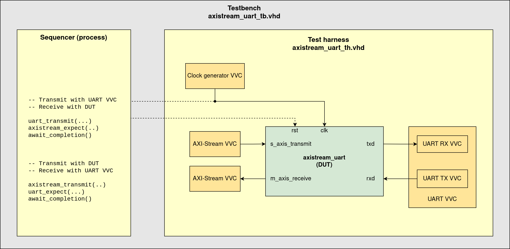

# axistream_uart

This repo contains a basic UART with AXI-Stream interface written in VHDL. It is intended as a demo/intro to UVVM, HDLregression, and basic CI simulation using GHDL.

# Getting started

## Prerequisites

Running the code in this repo requires:
- An installation of Modelsim. A good choice is the Intel Modelsim Starter edition, which can be downloaded for free from Intel's website.
  - The `vsim` command should be in your PATH
- A Python 3 installation
  - There should not be any dependencies or requirements

## Cloning the repo

Clone this repo: `git clone <repo-url>`. URLs for HTTPS/SSH are listed under `Code` on the GitHub frontpage for this project.

The code in this repo relies on two submodules: UVVM and HDLregression. These can be initialized by running:
```
cd axistream_uart            # cd into the project
git submodule init --update  # Initialize git submodules
```

## Running the simulation

Modelsim (and other simulators) generate several log and other output files in the working directory. It is recommended to run the scripts from the empty `run` directory. A gitignore file in this directory prevents these files from showing up as untracked in the git status.

From the root of the repo:
```
cd run
python ../scripts/run.py
```

This will compile and run every testbench in this project - when it is run the first time. HDLregression will not re-run tests unless there are changes, or unless it is instructed to do so.

Running the script with `-h` will print a help menu. Some interesting arguments for the scripts are:
`-ltc`: List test cases
`-g`: Run simulation in GUI mode (i.e. Modelsim GUI will open)
`-v`: Verbose output
`-tc <testcase name>`: Run a specific test case


# Documentation

A block diagram of the module is shown below. The receive and transmit parts of the module are technically independent, and two AXI-Stream interfaces are used to transmit to receive a byte.


## Baud generator

The `baud_gen` module implements a simple counter that counts the number of clock cycles in a baud period, based on the generic parameters for baud rate and clock frequency (`GC_BAUDRATE` and `GC_CLK_FREQ`).

The module restarts the baud counter on the rising edge of the `enable` signal. It will count indefinetely for as long as `enable` is held high.

A pulse (1 clock cycle long) is generated on the `baud_pulse` output for each baud period. Depending on the value of the `GC_BAUD_RX` parameter, it is possible to have the baud pulse generated at:
- `GC_BAUD_RX=false`: The beginning of a baud period - first pulse when `enable` goes high
- `GC_BAUD_RX=true`: The middle of a baud period - first pulse 1/2 baud period after `enable` goes high

The first mode (`GC_BAUD_RX=false`) is the intended mode for the transmit state machine (FSM), because then we'd want to start transmitting a bit immediately, and then wait a full baud period before transmitting the next bit.

The second mode (`GC_BAUD_RX=true`) is the intended mode for the receive FSM, because for the receiver we want the sample point to be in the middle of a bit period.

State diagrams for the transmit and receive FSMs are shown below.


## UVVM testbench

The structure of the testbench is illustrated below. Currently there are only a few basic tests defined to test transmit, receive, and simultaneous transmit+receive.


