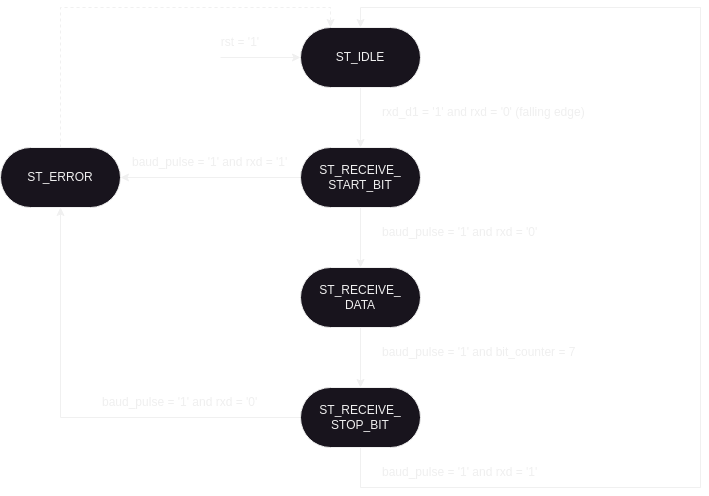

# axistream_uart

This repo contains a simple UART with AXI-Stream interface written in VHDL, which is intended for educational purposes. It can be used as a very quick learning example for VHDL and verification with UVVM + HDLregression. There are several exercises and solutions that are structured in different branches (more details under *Coding exercise* below).

The RTL and testbench code is gradually added in the *solution* branches. But the **main** branch contains all of the finished code and can probably be useful as a template or starting point for a module or project that uses UVVM+HDLregression.
But note that the UART module has not been tested in hardware. It will probably work, but use at your own risk. It is also very rudimentary with configuration options (e.g. it is hardcoded for 8N1).

# Getting started

## Prerequisites

Running the code in this repo requires:
- An installation of Modelsim. A good choice is the Intel Modelsim Starter edition, which can be downloaded for free from Intel's website.
  - The `vsim` command should be in your PATH
- A Python 3 installation
  - There should not be any dependencies or requirements

## Cloning the repo

Clone this repo: `git clone <repo-url>`. URLs for HTTPS/SSH are listed under `Code` on the GitHub frontpage for this project.

The code in this repo relies on two submodules: UVVM and HDLregression. These can be initialized by running:
```
cd axistream_uart            # cd into the project
git submodule init --update  # Initialize git submodules
```

## Running the simulation

Modelsim (and other simulators) generate several log and other output files in the working directory. It is recommended to run the scripts from the empty `run` directory. A gitignore file in this directory prevents these files from showing up as untracked in the git status.

From the root of the repo:
```
cd run
python ../scripts/run.py
```

This will compile and run every testbench in this project - when it is run the first time. HDLregression will not re-run tests unless there are changes, or unless it is instructed to do so.

Running the script with `-h` will print a help menu. Some interesting arguments for the scripts are:
`-ltc`: List test cases
`-g`: Run simulation in GUI mode (i.e. Modelsim GUI will open)
`-v`: Verbose output
`-tc <testcase name>`: Run a specific test case


# Coding exercise

## Part 1 - Finish the RTL code for the UART

| [Part 1](https://github.com/svnesbo/axistream_uart/tree/part1) | [Part 1 - Solution](https://github.com/svnesbo/axistream_uart/tree/part1_solution) |

In the `src/` directory you will find the following VHDL files:

```
axistream_uart.vhd
baud_gen.vhd
uart_rx.vhd
uart_tx.vhd
```

The top-level entity for the AXI-Stream UART is in `axistream_uart.vhd`. This file is completed already. You can see it has the two AXI-Stream interfaces we want for the module, which are connected to an instance of `uart_rx` and an instance of `uart_tx`.

### Baud generator

The `baud_gen` module implements a simple counter that counts the number of clock cycles in a baud period, based on the generic parameters for baud rate and clock frequency (`GC_BAUDRATE` and `GC_CLK_FREQ`).

The module restarts the baud counter on the rising edge of the `enable` signal. It will count indefinetely for as long as `enable` is held high.

A pulse (1 clock cycle long) is generated on the `baud_pulse` output for each baud period. Depending on the value of the `GC_BAUD_RX` parameter, it is possible to have the baud pulse generated at:
- `GC_BAUD_RX=false`: The beginning of a baud period - first pulse when `enable` goes high
- `GC_BAUD_RX=true`: The middle of a baud period - first pulse 1/2 baud period after `enable` goes high

The first mode (`GC_BAUD_RX=false`) is the intended mode for the transmit state machine (FSM), because you want to start transmitting a bit immediately, and then wait a full baud period before transmitting the next bit.

The second mode (`GC_BAUD_RX=true`) is the intended mode for the receive FSM, because for the receiver you would want the sample point to be in the middle of a bit period.


### UART Transmit FSM

The `uart_tx.vhd` file has the necessary entity and port declarations, some suggested signal declarations, an instance of the `baud_gen` module, but nothing else. You will implement the necessary logic for a state machine that can perform the AXI-Stream handshake and transmit bytes on the UART's Tx line.

A suggested state diagram is shown in the figure below:


The transmit logic can be very easily implemented with two states:
- Idle state:
  - The AXI-S tready signal is asserted, since we are not busy transmitting and can accept a byte to transmit
  - Performs the AXI-S handshake
  - When the handshake is done (tready and tvalid both asserted):
    - Accept the data byte (tdata)
	- Deassert tready
	- Setup a 10-bit vector with the bits to transmit: {stop-bit, tdata[7:0], start-bit} (where start bit is '0', and stop bit is '1').
	- Proceeds to transmit state 
- Transmit STATE:
  - Enable the baud generator
  - At the baud pulses:
    - Output the next bit from the 10-bit vector
  - Wait for an additional baud after writing the last bit - to allow a full baud period for the stop bit
  - When all bits have been transmitted:
    - Return to the idle state

Don't worry about compiling and running the code now. We will do that in [Part 2](https://github.com/svnesbo/axistream_uart/tree/part2).

### UART Receive FSM

~~The `uart_rx.vhd` file is missing. You will have to implement it in its entirety.~~

A suggested state diagram is shown below. In this case, there are a few more suggested states since the receiver has to distinguish between start/stop/data bits and perform error checking.



**Some pointers:**

Idle state:
- The idle value of UART Tx/Rx lines is '1' (high).
- Detect the transition from '1' -> '0' in the idle state of the FSM
  - Start the baud generator (it should generate baud pulses in the middle of baud periods)
  - Proceed to the state to receive start bit

Receive start bit state:
- Sample the bit when we get the baud pulse
- Verify correct value of start bit.
  - '0' (correct): Proceed to receive data
  - '1' (incorrect): Go to error state

Receive data state:
- Sample 8 bits (at baud pulse)
  - Shift them into an 8-bit vector
  - We receive and transmit LSB-first on the UART

Receive stop bit:
- Sample stop bit and verify correct value:
  - '1' (correct): Output received byte on AXI-Stream, return to idle state.
  - '0' (incorrect): Don't output received byte. Go to error state.

Error state:
- Pulse error output
- Return to idle state


**Solution:**

If you want to skip this part, need inspiration, or if you are simply stuck, there is a link to a fully working solution at the top of this section.


## Part 2 - Build and simulate using HDLregression

| [Part 2](https://github.com/svnesbo/axistream_uart/tree/part2) | [Part 2 - Solution](https://github.com/svnesbo/axistream_uart/tree/part2_solution) |

In this part you will find two new files. The first is this testbench file: `src/tb/axistream_uart_simple_tb.vhd`. This is a very rudimentary testbench. It does not require any work on your part and can be used for now to compile your code and simulate it. Stimuli is generated using a combinations of signal assignments and wait statements. This is an example of how we **don't** want to write testbenches. It is a lot of work and does not scale at all, it is error prone, and it is not self-checking but requires manual verification of waveforms. So we will **replace** this testbench with a UVVM-based one in part 3.

The other new file is a run script for the simulation: `scripts/run.py`. This script is based on Python and the HDLregression. HDLregression is a "test runner" capable of compiling and running testbench simulations. It can be used for regression testing of many testbenches (and test cases), but we are not going to use use the regression capabilities of HDLregression here.

The `run.py` file is only a template - you will have to add a couple of lines to compile all your code. When it's all set up you can run the testbench like this to have the Modelsim GUI open:
```
cd run/
python ../scripts/run.py -tc axistream_uart_simple_tb.tb -g
```

It's recommended to run the script from the `run/` directory (since Modelsim generates a lot of build and log files). If it's the first time you are compiling your code then it's more than likely that you will have to fix some compilation errors.

But when the simulation finally compiles and runs, you can expect the simulated waveform to look similar to the picture below. It shows the waveform of all the signals in the design after running the simulation. You can either add them manually and run the simulation using the GUI, or run the following commands in the Modelsim Transcript window to achieve the same:

```
add wave -r /*
run -all
```


By inspection you can tell that we were able to transmit the byte 0xAF with the UART, and also able to receive the byte 0xBC.

**Identifying files as testbenches for HDLregression**

Take special note of this line at the top of `axistream_uart_simple_tb.vhd`:

```
--- hdlregression:tb
```

HDLregression does **not** assume that filenames that include `_tb` are testbenches. It is this comment line that actually tells HDLregression that the entity contained in this file is a testbench that can be simulated. Try running this command to list the available testbenches/cases:

```
python ../scripts/run.py -ltc
```

The output should look something like this:
```
====================================================================================================================================================
  HDLRegression version 0.46.2
  See /doc/hdlregression.pdf for documentation.
====================================================================================================================================================


Scanning files...
Building test suite structure...
TC:1 - axistream_uart_simple_tb.tb
```

Now, try to remove the `--- hdlregression:tb` from the testbench, and re-run the command. You will see that the line `TC:1 - axistream_uart_simple_tb.tb` has disappeared from the output so you can no longer simulate the testbench.


## Part 3 - Write a UVVM-based testbench for the UART

| [Part 3](https://github.com/svnesbo/axistream_uart/tree/part3) | [Part 3 - Solution](https://github.com/svnesbo/axistream_uart/tree/part3_solution) |

For the third exercise two new files have appeared in the `src/tb` directory. These are files for a UVVM-based test bench and test harness that we will write.


It's probably a good idea to first setup the harness in the `axistream_uart_uvvm_th.vhd` file. It should have an instance of the Device Under Test (DUT), which is our UART, as well as instances of the verification components that we will use (the UVVM VVCs, or VHDL Verification Components), and the necessary signals to connect them all together.

In the testbench we have to create an instance of the harness and signals that port map to the harness (if any, the VVCs are controlled via UVVM commands, so it is fully possible to write a harness with no port signals). Technically it is not required in anyway to separate the harness and test bench, but it makes the test bench less cluttered. The testbench will then consist primarily of the "sequencer", the VHDL process where we execute VVC procedure calls to make the VVCs interact with the DUT, such as sending and receiving data, or expecting to receive data of a certain value.


## Part 4 - Extend the UVVM-based testbench with individual test cases

| [Part 4](https://github.com/svnesbo/axistream_uart/tree/part4) | [Part 4 - Solution](https://github.com/svnesbo/axistream_uart/tree/part4_solution) |

Not done yet :)
